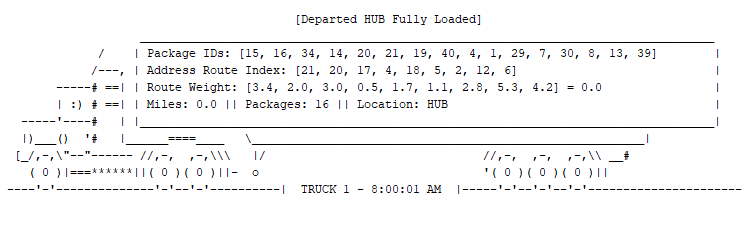
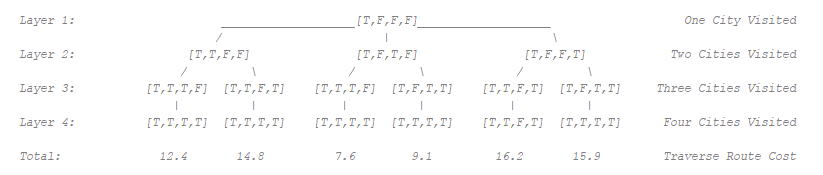

# Traveling Salesman Final Project
In this final project, I apply the algorithms and data structures studied to solve a variation of the traveling salesman problem. This program is designed to find the shortest route to deliver all packages while incurring the least number of miles. This program follows all simulation rules and meets the special requirements for all package deliveries.

<p align="center">
	</img>
</p>

## Project Objective

Amazon.com needs to determine the best route and delivery distribution for their Daily Local Deliveries (DLD) because packages are not currently being consistently delivered by their promised deadline. The Salt Lake City Fulfillment Center has three trucks, two drivers, and an average of 40 Prime packages to deliver each day; each package has specific criteria and delivery requirements.

Amazon Logistics has tasked you to determine the best algorithm, write code, and present a solution where all 40 packages, listed in the attached "Package Table File," will be delivered on time with the least number of miles added to the combined mileage total of all trucks. The specific delivery locations and distances to each location are given in the attached "Distance Matrix File." In addition, you should keep in mind that the supervisor should be able to see, at assigned points, the progress of each truck and its packages listed by any of the variables listed in the “Package Table File,” including what has been delivered and what time the delivery occurred.

The intent is to use this solution (program) for this specific location and to use the same program in many cities in each state where Amazon.com has a presence.


## Data Structures

The environment runs in Python 3.6, requires no external libraries or APIs, and the IDE of choice is Pycharm. The communication protocol used in this project is by storing all data in class variables and executing all algorithms from class functions. Should one class need another variable from another class, a reference is made for that class and the variable is copied from it. The variable contained in each class are useful for executing the functions located in that class. The Hub class contains loading algorithms, the Truck class contains delivery algorithms, the Simulation class contains ticking algorithms, and the Clock class contains time algorithm.

The entire simulation runs in this execute function, which appears in pseudocode as below:


<b>Execute</b>
```
Setup Simulation
While True:
	GUI Algorithm
	Tick Algorithm
	Special Algorithm
	For trucks in all trucks:
		Drive Truck Algorithm
		Load Truck Algorithm
		Deliver Truck Algorithm
```

This function handles all the looping events every second. When it determines all packages are delivered, the while loop ends. All simulation connections and data exchanges occurs in the algorithms that appears in this execute function. In each algorithm are lower level algorithms that handle lower level details. At a high level overview, these algorithms mentioned are the primary communication protocols to run the simulation and exchange data for each simulation tick.

## Algorithms

There are many algorithms in this program. The algorithms worth examining are the ones that that select the packages and load the truck. These algorithms are called Do_Not_Ship, Load_Truck, and Hamiltonian_Cycle. Each algorithm is designed to maximize optimization and serve a functional role in minimizing the accrued number of miles for delivery. Below is the pseudocode for each algorithm:


<b>Do_Not_Ship</b>
```
Loop through all packages – O(N²)
	If package is delayed or has bad address then
		Remove package from selection pool
		Save address in delayed address list
Loop through all packages – O(N²)
	If package address in delayed address list then
		Remove package from selection pool
```

The first algorithm <i>Do_Not_Ship</i> separates which packages should and should not be available for loading onto the trucks. Packages that are delayed or have a bad address become unavailable for loading. Packages that share an address with one of the delayed packages also become unavailable for loading. This is programmed such that the trucks can be loaded with as many packages that are delivered to same address at once.


<b>Load_Truck</b>
```
Loop through all packages – O(N²)
	If package cannot be loaded due to truck number then
		Remove package from selection pool
Loop through all packages – O(N²)
	If package has a deadline then
		Load package on truck
Loop through all packages – O(N²)
	If package address shares address with package loaded on truck then
		Load package on truck
If truck is over capacity then
	Loop through all packages loaded on truck – O(N²)
		Remove non-address-sharing packages
		Stop if below capacity
	Loop through all packages loaded on truck – O(N²)
		Remove address-sharing packages
		Stop if below capacity
If truck is under capacity then
	Save truck state – O(K)
	Loop M number of times – O(M · N!)
		Reset truck state
		Load truck with random packages
		Load truck with shared address packages
		If truck is over capacity then
			Remove packages
		Call Hamiltonian_Cycle
		If route is lowest miles
		Save package IDs
	Load truck with saved package IDs – O(N)
```

The second algorithm <i>Load_Truck</i> will prioritize which packages should be loaded onto the truck. It starts by selecting which packages have delivery deadlines and loads these packages first. Next, it loops M number of times and begins randomly selecting packages to load onto the truck. Each loop calls the <i>Hamiltonian Cycle</i> algorithm to find the lowest route miles to deliver all packages to their destinations. If the route miles is the lowest seen out of all M loops it will save the package IDs. When the loop finishes, the truck is loaded with the saved package IDs.


<b>Hamiltonian_Cycle</b>
```
Construct distance matrix – O(N²)
Construct bitmap – O(N)
	Run Hamiltonian Cycle – O(N!)
		If all locations visited then
			If route is lowest miles then
				Save total miles
				Save route history
				Save miles history
		Loop through all locations
			If location is unvisited then
				Visit location
				Increase total miles
				Update route history
				Update miles history
				Call Hamiltonian_Cycle
```

<p align="center">
	</img>
</p>

The third algorithm <i>Hamiltonian_Cycle</i> finds the lowest mileage route to deliver all packages to their destinations. The algorithm begins with only the HUB visited and all other locations unvisited. It then recursively visits every location from every other location, in every possible sequence, until all locations are visited. Each time the base case is reached, where all locations are visited, the algorithm checks if the route traversal has the lowest number of miles. If the route is the lowest, it saves information about the route. Information saved includes the total number of miles, the address IDs traversed in sequence, and the miles incurred for each address ID. This information is later passed onto the truck which then begins deliveries.

## Additional Comments

As of submitting this project, it holds a record for the least amount of miles to deliver all packages at 76.1 total miles. Thank you for checking out this GitHub repository! This program was very fun to build.

## Sources
1.	Lysecky, R. and Vahid, F. (2019). C950: Data Structures and Algorithms II. [online] ZyBooks.com. Available at: 	https://learn.zybooks.com/zybook/WGUC950AY20182019 [Accessed 20 May 2019].
2.	Lysecky, R. and Vahid, F. (2018). C949: Data Structures and Algorithms I. [online] ZyBooks.com. Available at: 	https://learn.zybooks.com/zybook/WGUC9492018 [Accessed 16 May 2019].
3.	Matthes, E. (2016). Python Crash Course. 1st ed. San Francisco: No Starch Press, Incorporated, pp.118 - 214.
4.	Miller, B. and Ranum, D. (2011). Problem solving with algorithms and data structures using Python. 2nd ed. 	Sherwood: Franklin, Beedle & Associates, Incorporated, pp.1 - 80, 149 - 230.
5.	Docs.python.org. (2019). 3.7.3 Documentation. [online] Available at: https://docs.python.org/ [Accessed 18 May 	2019].
