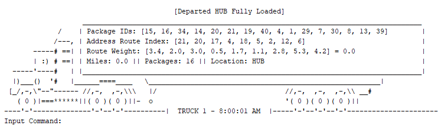

# WGUPS Final Project
In this final project, I apply the algorithms and data structures studied at WGU to solve a real world programming problem. This program is designed to find the least number of miles to deliver all packages from a warehouse. An implementation of a random algorithm is used to find packages to load onto each truck. A [Hamiltonian Cycle](https://youtu.be/JE0JE8ce1V0) algorithm is then used to find the best route.

<p align="center">
	</img>
</p>

## What is the objective?
The objective of this assignment is to drive the least number of miles to deliver all packages from a warehouse. There are 40 packages in the warehouse and there are 26 possible delivery destinations. The warehouse has 2 trucks that can make these deliveries. Many packages have special instructions or delivery deadlines that add layers of complexity.

The program developed must pay careful attention to many different variables to ensure all package instructions and deadlines are met while traveling the least number of miles. The program must also include an array of GUI features to simulate a manager utilizing the software.

## How does the program work?
The environment runs in Python 3.6, requires no external libraries or APIs, and the IDE of choice is Pycharm. The communication protocol used in this project is by storing all data in class variables and executing all algorithms from class functions. The entire simulation runs in this simulation execute function, which appears as below:

<b>Execute</b>
```
Setup Simulation
While True:
	GUI Algorithm
	Tick Algorithm
	Special Algorithm
	For trucks in all trucks:
		Drive Truck Algorithm
		Load Truck Algorithm
		Deliver Truck Algorithm
```

This function handles all the looping events every second. When it determines all packages are delivered, the while loop ends. All simulation connections and data exchanges occurs in the algorithms that appears in this execute function. In each algorithm are lower level algorithms that handle lower level details. At a high level overview, these algorithms mentioned are the primary communication protocols to run the simulation and exchange data for each simulation tick.

## How do the algorithms work?
The package loading algorithms are located in the Hub class. Each algorithm is designed to maximize optimization and serve a functional role in minimizing the accrued number of miles for delivery. Below is the pseudocode for each algorithm along with an explanation:

<b>Do_Not_Ship</b>
```
Loop through all packages – O(N²)
	If package is delayed or has bad address then
		Remove package from selection pool
		Save address in delayed address list
Loop through all packages – O(N²)
	If package address in delayed address list then
		Remove package from selection pool
```

The first algorithm <i>Do_Not_Ship</i> separates which packages should and should not be available for loading onto the trucks. Packages that are delayed or have a bad address become unavailable for loading. Packages that share an address with one of the delayed packages also become unavailable for loading. This is programmed such that the trucks can be loaded with as many packages that are delivered to same address at once.


<b>Load_Truck</b>
```
Loop through all packages – O(N²)
	If package cannot be loaded due to truck number then
		Remove package from selection pool
Loop through all packages – O(N²)
	If package has a deadline then
		Load package on truck
Loop through all packages – O(N²)
	If package address shares address with package loaded on truck then
		Load package on truck
If truck is over capacity then
	Loop through all packages loaded on truck – O(N²)
		Remove non-address-sharing packages
		Stop if below capacity
	Loop through all packages loaded on truck – O(N²)
		Remove address-sharing packages
		Stop if below capacity
If truck is under capacity then
	Save truck state – O(K)
	Loop M number of times – O(M · N!)
		Reset truck state
		Load truck with random packages
		Load truck with shared address packages
		If truck is over capacity then
			Remove packages
		Call Hamiltonian_Cycle
		If route is lowest miles
		Save package IDs
	Load truck with saved package IDs – O(N)
```

The second algorithm <i>Load_Truck</i> will prioritize which packages should be loaded onto the truck. It starts by selecting which packages have delivery deadlines and loads these packages first. Next, it loops M number of times and begins randomly selecting packages to load onto the truck. Each loop calls the <i>Hamiltonian Cycle/<i> algorithm to find the lowest route miles to deliver all packages to their destinations. If the route miles is the lowest seen out of all M loops it will save the package IDs. When the loop finishes, the truck is loaded with the saved package IDs.


<b>Hamiltonian_Cycle</b>
```
Construct distance matrix – O(N²)
Construct bitmap – O(N)
	Run Hamiltonian Cycle – O(N!)
		If all locations visited then
			If route is lowest miles then
				Save total miles
				Save route history
				Save miles history
		Loop through all locations
			If location is unvisited then
				Visit location
				Increase total miles
				Update route history
				Update route miles
				Call Hamiltonian_Cycle
```

The third algorithm <i>Hamiltonian_Cycle</i> finds the lowest mileage route to deliver all packages to their destinations. The algorithm begins with only the HUB visited and all other locations unvisited. It then recursively visits every location from every other location, in every possible sequence, until all locations are visited. Each time the base case is reached, where all locations are visited, the algorithm checks if the route traversal has the lowest number of miles. If the route is the lowest, it saves information about the route. Information saved includes the total number of miles, the address IDs traversed in sequence, and the miles incurred for each address ID. This information is later passed onto the truck which then begins deliveries.

## Additional Comments
Further explanation about the program can be found in the project essay files. As of submitting this project, it currently holds the university record for the lowest amount of miles to deliver all packages at 76.1 total miles.

Thank you for checking out this GitHub repository!

## Sources
1.	Lysecky, R. and Vahid, F. (2019). C950: Data Structures and Algorithms II. [online] ZyBooks.com. Available at: 	https://learn.zybooks.com/zybook/WGUC950AY20182019 [Accessed 20 May 2019].
2.	Lysecky, R. and Vahid, F. (2018). C949: Data Structures and Algorithms I. [online] ZyBooks.com. Available at: 	https://learn.zybooks.com/zybook/WGUC9492018 [Accessed 16 May 2019].
3.	Matthes, E. (2016). Python Crash Course. 1st ed. San Francisco: No Starch Press, Incorporated, pp.118 - 214.
4.	Miller, B. and Ranum, D. (2011). Problem solving with algorithms and data structures using Python. 2nd ed. 	Sherwood: Franklin, Beedle & Associates, Incorporated, pp.1 - 80, 149 - 230.
5.	Docs.python.org. (2019). 3.7.3 Documentation. [online] Available at: https://docs.python.org/ [Accessed 18 May 	2019].
